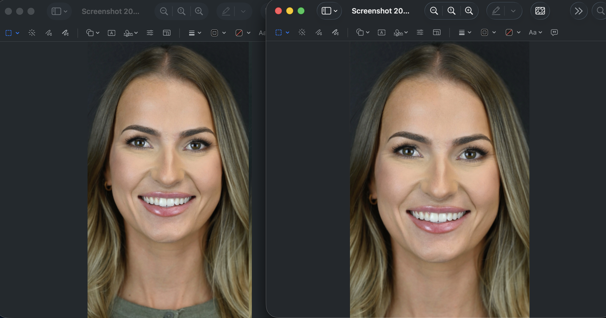
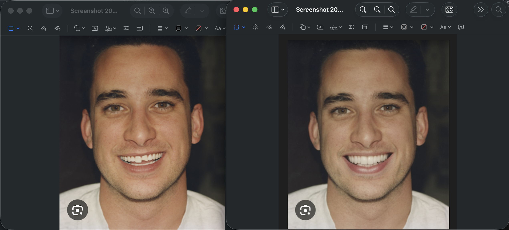

# VeneerVision AI

A full-stack AI-powered dental veneer simulation application that generates realistic veneer previews from smile photos. Dentists and patients can upload a smile image, select a veneer shade, and receive AI-generated previews of potential outcomes.




---

## Features

- **AI Veneer Simulation** using Stable Diffusion XL inpainting with custom tooth segmentation
- **Multiple Variations** — generate up to 4 different simulation options in Dentist Mode
- **Automatic Mouth Detection** via a trained ResNeSt50 segmentation model (with HSV fallback)
- **Veneer Shade Selection** — choose from natural white, bright white, and other shades
- **Smile Style Quiz** for personalized veneer recommendations
- **PDF Report Generation** for professional consultations
- **Lead Capture** to collect patient and dentist contact information
- **Drag & Drop Upload** and camera capture support
- **Responsive UI** built with Next.js and Tailwind CSS

---

## Tech Stack

| Layer | Technologies |
|-------|-------------|
| **Frontend** | Next.js 16, React 19, TypeScript, Tailwind CSS, Radix UI, React Hook Form, Zod |
| **Backend** | Python, Flask, Flask-CORS |
| **ML / AI** | PyTorch, Stable Diffusion XL (Diffusers), ResNeSt50 tooth segmentation |
| **Image Processing** | OpenCV, Pillow, scikit-image, Albumentations |
| **Infrastructure** | Docker (NVIDIA CUDA 12.1), Docker Compose, AWS (S3, CloudFront, Elastic Beanstalk) |
| **CI/CD** | GitHub Actions |

---

## Architecture

```
VeneerLounge/
├── VeneerApp-main/          # Next.js frontend
│   ├── app/                 # App Router (pages + API routes)
│   ├── components/          # React components (upload, shade selector, results, etc.)
│   └── hooks/ & lib/        # Custom hooks and utilities
├── services/
│   ├── veneer-preview/      # Flask API server (port 8000)
│   └── tooth-segmentation/  # Segmentation utilities
├── ext/
│   ├── veneer_generation/   # SDXL, ControlNet, and Pix2Pix model wrappers
│   └── individual_tooth_segmentation/  # ResNeSt50 model training & inference
├── data/                    # Training datasets and annotations
├── infrastructure/          # AWS deployment configs
├── DockerFile               # CUDA-enabled container
└── docker-compose.yml       # Service orchestration
```

**Pipeline**: Upload image -> ResNeSt50 detects teeth region -> SDXL inpaints veneers onto masked area -> composited result returned to frontend.

---

## Getting Started

### Prerequisites

- Python 3.10+
- Node.js 18+
- (Optional) NVIDIA GPU with CUDA 12.1 for faster inference

### 1. Clone the Repository

```bash
git clone https://github.com/joshwu108/VeneerLounge.git
cd VeneerLounge
```

### 2. Set Up the Python Environment

```bash
bash setup_venv.sh
```

### 3. Download Pretrained Models

```bash
bash setup_pretrained_models_fixed.sh
```

### 4. Install Frontend Dependencies

```bash
cd VeneerApp-main && npm install
```

### 5. Run the App

```bash
bash start_veneer_app.sh
```

This starts both the Flask backend (port 8000) and the Next.js frontend (port 3000).

Visit [http://localhost:3000](http://localhost:3000) to use the app.

### Docker (Alternative)

```bash
docker-compose up --build
```

The backend will be available on port 8000. Start the frontend separately with `cd VeneerApp-main && npm run dev`.

---

## API Endpoints

| Method | Endpoint | Description |
|--------|----------|-------------|
| POST | `/api/veneer-preview` | Generate veneer preview from base64 image |
| POST | `/api/veneer-preview/file` | Generate veneer preview from uploaded file |
| GET | `/health` | Service health check |
| GET | `/api/model/info` | Get currently loaded model info |
| POST | `/api/model/reload` | Switch between SDXL, ControlNet, or Pix2Pix |

---

## Supported Models

| Model | Description |
|-------|-------------|
| **SDXL Inpainting** (default) | Stable Diffusion XL — highest quality results |
| **ControlNet** | Segmentation-conditioned generation |
| **Pix2Pix** | Fast baseline image-to-image translation |

Switch models at runtime via the `/api/model/reload` endpoint or the `VENEER_MODEL_TYPE` environment variable.

---

## License

MIT
